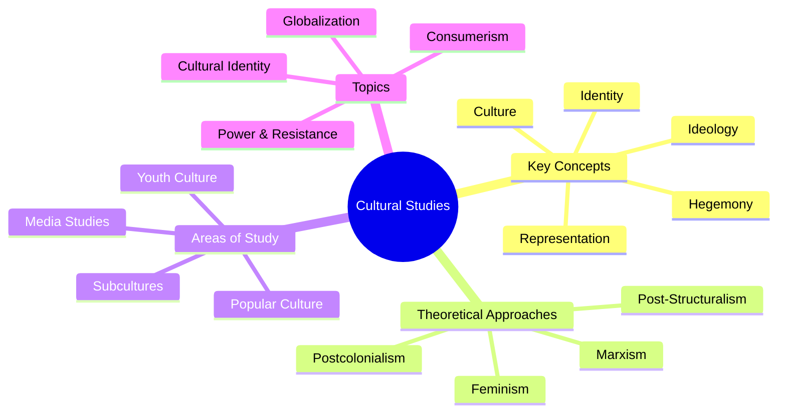

```mermaid
mindmap
  root((Cultural Studies))
    Key Concepts
      Culture
      Ideology
      Hegemony
      Identity
      Representation
    Theoretical Approaches
      Marxism
      Post-Structuralism
      Postcolonialism
      Feminism
    Areas of Study
      Popular Culture
      Media Studies
      Youth Culture
      Subcultures
    Topics
      Globalization
      Consumerism
      Cultural Identity
      Power & Resistance
```

