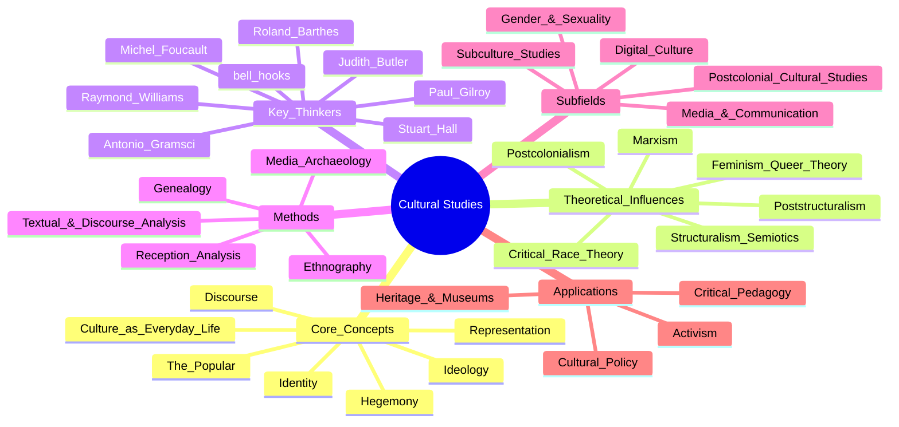

```mermaid
mindmap
  root((Cultural Studies))
    Core_Concepts
      Hegemony
      Ideology
      Representation
      Culture_as_Everyday_Life
      Identity
      Discourse
      The_Popular
    Theoretical_Influences
      Marxism
      Structuralism_Semiotics
      Poststructuralism
      Feminism_Queer_Theory
      Postcolonialism
      Critical_Race_Theory
    Key_Thinkers
      Raymond_Williams
      Stuart_Hall
      Antonio_Gramsci
      Michel_Foucault
      Roland_Barthes
      Judith_Butler
      bell_hooks
      Paul_Gilroy
    Methods
      Textual_&_Discourse_Analysis
      Ethnography
      Reception_Analysis
      Genealogy
      Media_Archaeology
    Subfields
      Media_&_Communication
      Subculture_Studies
      Postcolonial_Cultural_Studies
      Gender_&_Sexuality
      Digital_Culture
    Applications
      Critical_Pedagogy
      Cultural_Policy
      Activism
      Heritage_&_Museums
```

