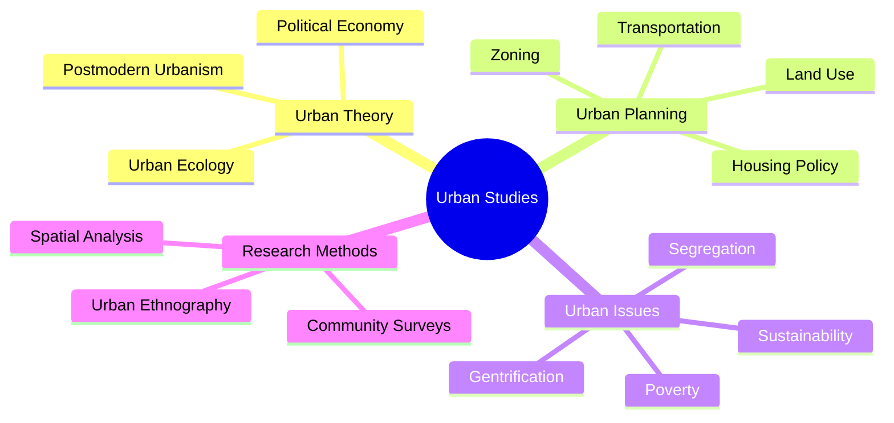

```mermaid
mindmap
  root((Urban Studies))
    Urban Theory
      Urban Ecology
      Political Economy
      Postmodern Urbanism
    Urban Planning
      Land Use
      Transportation
      Housing Policy
      Zoning
    Urban Issues
      Gentrification
      Segregation
      Poverty
      Sustainability
    Research Methods
      Urban Ethnography
      Spatial Analysis
      Community Surveys
```

