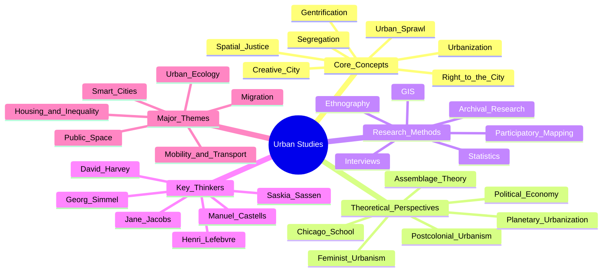

```mermaid
mindmap
  root((Urban Studies))
    Core_Concepts
      Urbanization
      Gentrification
      Spatial_Justice
      Right_to_the_City
      Urban_Sprawl
      Segregation
      Creative_City
    Theoretical_Perspectives
      Chicago_School
      Political_Economy
      Feminist_Urbanism
      Postcolonial_Urbanism
      Assemblage_Theory
      Planetary_Urbanization
    Research_Methods
      Ethnography
      GIS
      Interviews
      Statistics
      Archival_Research
      Participatory_Mapping
    Key_Thinkers
      Georg_Simmel
      Henri_Lefebvre
      Jane_Jacobs
      David_Harvey
      Saskia_Sassen
      Manuel_Castells
    Major_Themes
      Housing_and_Inequality
      Mobility_and_Transport
      Urban_Ecology
      Smart_Cities
      Migration
      Public_Space
```

