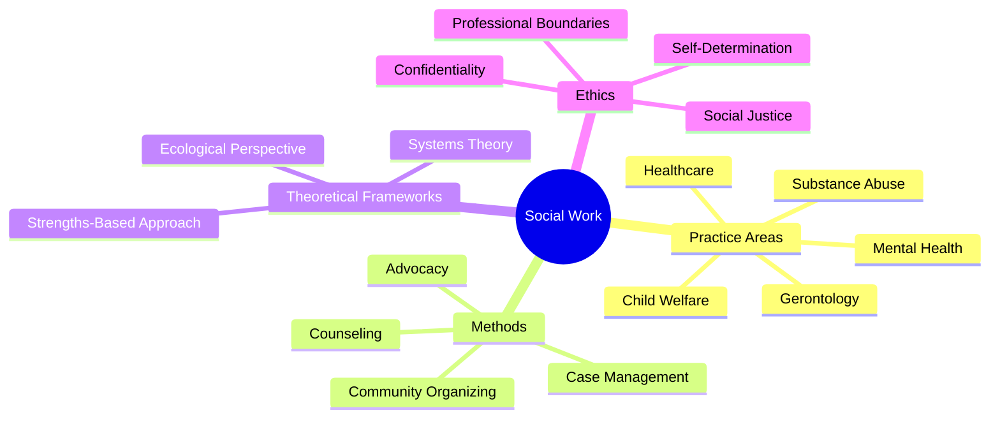

```mermaid
mindmap
  root((Social Work))
    Practice Areas
      Child Welfare
      Mental Health
      Substance Abuse
      Gerontology
      Healthcare
    Methods
      Case Management
      Counseling
      Advocacy
      Community Organizing
    Theoretical Frameworks
      Systems Theory
      Ecological Perspective
      Strengths-Based Approach
    Ethics
      Confidentiality
      Self-Determination
      Social Justice
      Professional Boundaries
```

