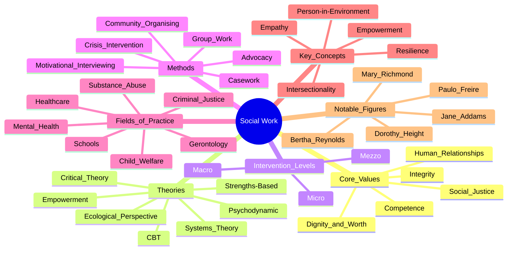

```mermaid
mindmap
  root((Social Work))
    Core_Values
      Social_Justice
      Dignity_and_Worth
      Integrity
      Competence
      Human_Relationships
    Theories
      Systems_Theory
      Ecological_Perspective
      Strengths‑Based
      Empowerment
      Psychodynamic
      CBT
      Critical_Theory
    Intervention_Levels
      Micro
      Mezzo
      Macro
    Methods
      Casework
      Group_Work
      Community_Organising
      Advocacy
      Crisis_Intervention
      Motivational_Interviewing
    Fields_of_Practice
      Child_Welfare
      Mental_Health
      Healthcare
      Schools
      Gerontology
      Criminal_Justice
      Substance_Abuse
    Key_Concepts
      Person‑in‑Environment
      Empathy
      Empowerment
      Resilience
      Intersectionality
    Notable_Figures
      Jane_Addams
      Mary_Richmond
      Bertha_Reynolds
      Paulo_Freire
      Dorothy_Height
```

