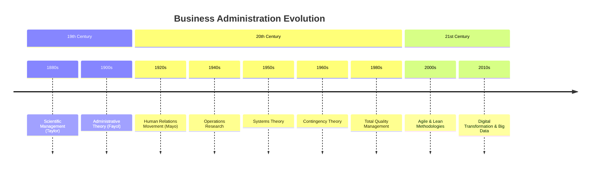

```mermaid
timeline
    title Business Administration Evolution
    section 19th Century
        1880s : Scientific Management (Taylor)
        1900s : Administrative Theory (Fayol)
    section 20th Century
        1920s : Human Relations Movement (Mayo)
        1940s : Operations Research
        1950s : Systems Theory
        1960s : Contingency Theory
        1980s : Total Quality Management
    section 21st Century
        2000s : Agile & Lean Methodologies
        2010s : Digital Transformation & Big Data
```
