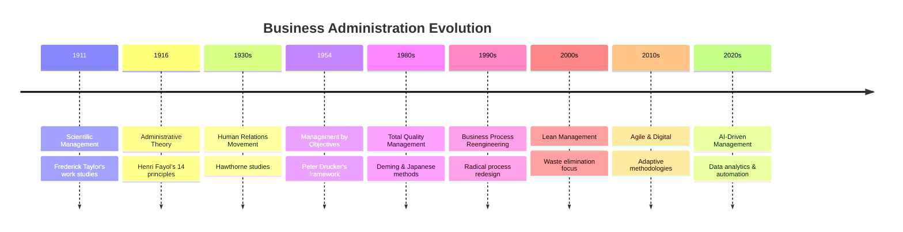

```mermaid
timeline
    title Business Administration Evolution
    1911 : Scientific Management
         : Frederick Taylor's work studies
    1916 : Administrative Theory
         : Henri Fayol's 14 principles
    1930s : Human Relations Movement
          : Hawthorne studies
    1954 : Management by Objectives
         : Peter Drucker's framework
    1980s : Total Quality Management
          : Deming & Japanese methods
    1990s : Business Process Reengineering
          : Radical process redesign
    2000s : Lean Management
          : Waste elimination focus
    2010s : Agile & Digital
          : Adaptive methodologies
    2020s : AI-Driven Management
          : Data analytics & automation
```
