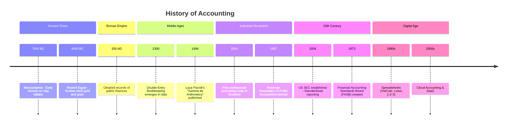

```mermaid
timeline
    title History of Accounting
    section Ancient Times
        7000 BC : Mesopotamia - Early records on clay tablets
        4000 BC : Ancient Egypt - Scribes track gold and grain
    section Roman Empire
        200 AD : Detailed records of public finances
    section Middle Ages
        1300 : Double-Entry Bookkeeping emerges in Italy
        1494 : Luca Pacioli's "Summa de Arithmetica" published
    section Industrial Revolution
        1854 : First professional accounting body in Scotland
        1887 : American Association of Public Accountants formed
    section 20th Century
        1934 : US SEC established - Standardized reporting
        1973 : Financial Accounting Standards Board (FASB) created
    section Digital Age
        1980s : Spreadsheets (VisiCalc, Lotus 1-2-3)
        2000s : Cloud Accounting & SaaS
```
