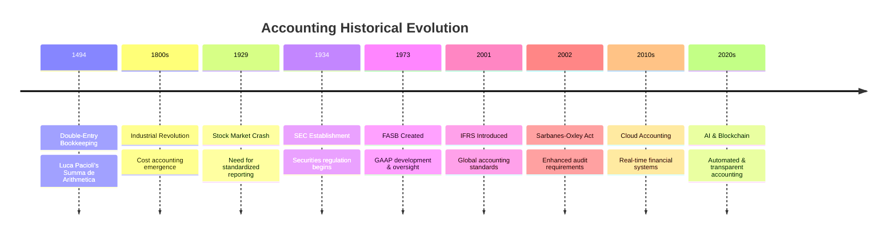

```mermaid
timeline
    title Accounting Historical Evolution
    1494 : Double-Entry Bookkeeping
         : Luca Pacioli's Summa de Arithmetica
    1800s : Industrial Revolution
          : Cost accounting emergence
    1929 : Stock Market Crash
         : Need for standardized reporting
    1934 : SEC Establishment
         : Securities regulation begins
    1973 : FASB Created
         : GAAP development & oversight
    2001 : IFRS Introduced
         : Global accounting standards
    2002 : Sarbanes-Oxley Act
         : Enhanced audit requirements
    2010s : Cloud Accounting
          : Real-time financial systems
    2020s : AI & Blockchain
          : Automated & transparent accounting
```
