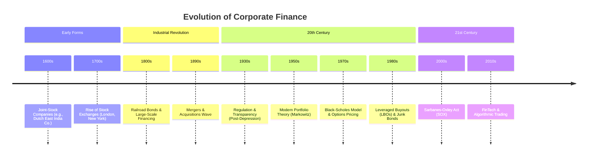

```mermaid
timeline
    title Evolution of Corporate Finance
    section Early Forms
        1600s : Joint-Stock Companies (e.g., Dutch East India Co.)
        1700s : Rise of Stock Exchanges (London, New York)
    section Industrial Revolution
        1800s : Railroad Bonds & Large-Scale Financing
        1890s : Mergers & Acquisitions Wave
    section 20th Century
        1930s : Regulation & Transparency (Post-Depression)
        1950s : Modern Portfolio Theory (Markowitz)
        1970s : Black-Scholes Model & Options Pricing
        1980s : Leveraged Buyouts (LBOs) & Junk Bonds
    section 21st Century
        2000s : Sarbanes-Oxley Act (SOX)
        2010s : FinTech & Algorithmic Trading
```
