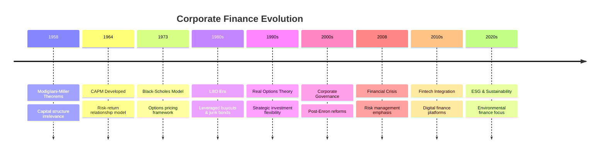

```mermaid
timeline
    title Corporate Finance Evolution
    1958 : Modigliani-Miller Theorems
         : Capital structure irrelevance
    1964 : CAPM Developed
         : Risk-return relationship model
    1973 : Black-Scholes Model
         : Options pricing framework
    1980s : LBO Era
          : Leveraged buyouts & junk bonds
    1990s : Real Options Theory
          : Strategic investment flexibility
    2000s : Corporate Governance
          : Post-Enron reforms
    2008 : Financial Crisis
         : Risk management emphasis
    2010s : Fintech Integration
          : Digital finance platforms
    2020s : ESG & Sustainability
          : Environmental finance focus
```
