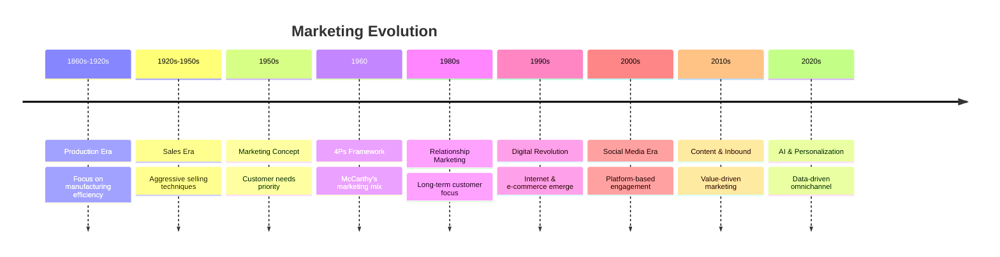

```mermaid
timeline
    title Marketing Evolution
    1860s-1920s : Production Era
                : Focus on manufacturing efficiency
    1920s-1950s : Sales Era
                : Aggressive selling techniques
    1950s : Marketing Concept
          : Customer needs priority
    1960 : 4Ps Framework
         : McCarthy's marketing mix
    1980s : Relationship Marketing
          : Long-term customer focus
    1990s : Digital Revolution
          : Internet & e-commerce emerge
    2000s : Social Media Era
          : Platform-based engagement
    2010s : Content & Inbound
          : Value-driven marketing
    2020s : AI & Personalization
          : Data-driven omnichannel
```
