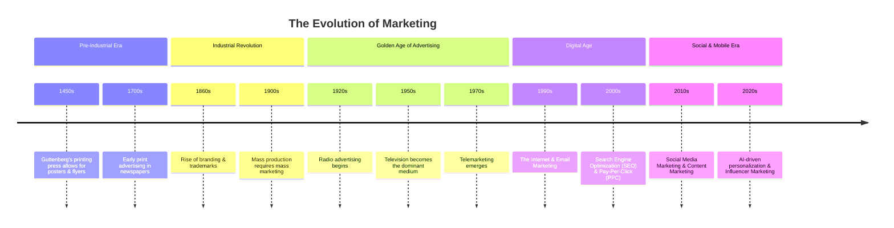

```mermaid
timeline
    title The Evolution of Marketing
    section Pre-Industrial Era
        1450s : Guttenberg's printing press allows for posters & flyers
        1700s : Early print advertising in newspapers
    section Industrial Revolution
        1860s : Rise of branding & trademarks
        1900s : Mass production requires mass marketing
    section Golden Age of Advertising
        1920s : Radio advertising begins
        1950s : Television becomes the dominant medium
        1970s : Telemarketing emerges
    section Digital Age
        1990s : The Internet & Email Marketing
        2000s : Search Engine Optimization (SEO) & Pay-Per-Click (PPC)
    section Social & Mobile Era
        2010s : Social Media Marketing & Content Marketing
        2020s : AI-driven personalization & Influencer Marketing
```
