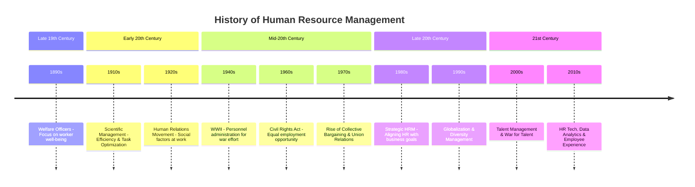

```mermaid
timeline
    title History of Human Resource Management
    section Late 19th Century
        1890s : Welfare Officers - Focus on worker well-being
    section Early 20th Century
        1910s : Scientific Management - Efficiency & Task Optimization
        1920s : Human Relations Movement - Social factors at work
    section Mid-20th Century
        1940s : WWII - Personnel administration for war effort
        1960s : Civil Rights Act - Equal employment opportunity
        1970s : Rise of Collective Bargaining & Union Relations
    section Late 20th Century
        1980s : Strategic HRM - Aligning HR with business goals
        1990s : Globalization & Diversity Management
    section 21st Century
        2000s : Talent Management & War for Talent
        2010s : HR Tech, Data Analytics & Employee Experience
```
