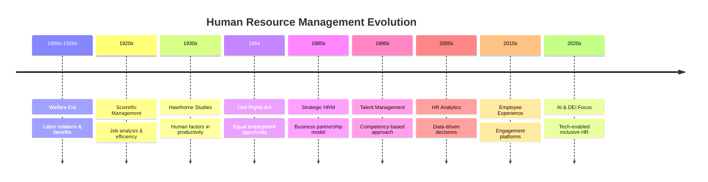

```mermaid
timeline
    title Human Resource Management Evolution
    1900s-1920s : Welfare Era
                : Labor relations & benefits
    1920s : Scientific Management
          : Job analysis & efficiency
    1930s : Hawthorne Studies
          : Human factors in productivity
    1964 : Civil Rights Act
         : Equal employment opportunity
    1980s : Strategic HRM
          : Business partnership model
    1990s : Talent Management
          : Competency-based approach
    2000s : HR Analytics
          : Data-driven decisions
    2010s : Employee Experience
          : Engagement platforms
    2020s : AI & DEI Focus
          : Tech-enabled inclusive HR
```
