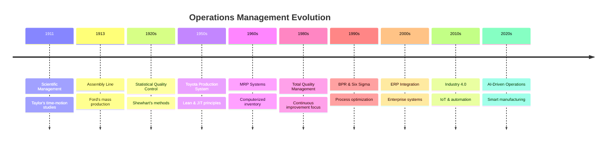

```mermaid
timeline
    title Operations Management Evolution
    1911 : Scientific Management
         : Taylor's time-motion studies
    1913 : Assembly Line
         : Ford's mass production
    1920s : Statistical Quality Control
          : Shewhart's methods
    1950s : Toyota Production System
          : Lean & JIT principles
    1960s : MRP Systems
          : Computerized inventory
    1980s : Total Quality Management
          : Continuous improvement focus
    1990s : BPR & Six Sigma
          : Process optimization
    2000s : ERP Integration
          : Enterprise systems
    2010s : Industry 4.0
          : IoT & automation
    2020s : AI-Driven Operations
          : Smart manufacturing
```
