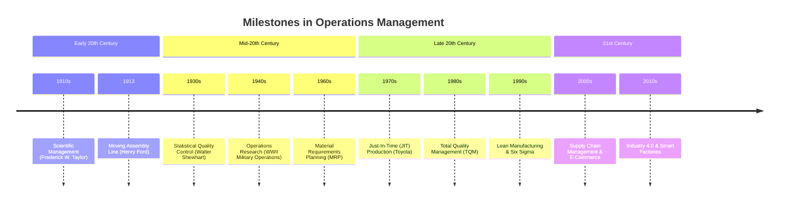

```mermaid
timeline
    title Milestones in Operations Management
    section Early 20th Century
        1910s : Scientific Management (Frederick W. Taylor)
        1913 : Moving Assembly Line (Henry Ford)
    section Mid-20th Century
        1930s : Statistical Quality Control (Walter Shewhart)
        1940s : Operations Research (WWII Military Operations)
        1960s : Material Requirements Planning (MRP)
    section Late 20th Century
        1970s : Just-In-Time (JIT) Production (Toyota)
        1980s : Total Quality Management (TQM)
        1990s : Lean Manufacturing & Six Sigma
    section 21st Century
        2000s : Supply Chain Management & E-Commerce
        2010s : Industry 4.0 & Smart Factories
```
