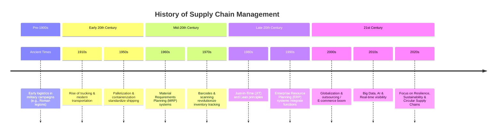

```mermaid
timeline
    title History of Supply Chain Management
    section Pre-1900s
        Ancient Times : Early logistics in military campaigns (e.g., Roman legions)
    section Early 20th Century
        1910s : Rise of trucking & modern transportation
        1950s : Palletization & containerization standardize shipping
    section Mid-20th Century
        1960s : Material Requirements Planning (MRP) systems
        1970s : Barcodes & scanning revolutionize inventory tracking
    section Late 20th Century
        1980s : Just-In-Time (JIT) and Lean principles
        1990s : Enterprise Resource Planning (ERP) systems integrate functions
    section 21st Century
        2000s : Globalization & outsourcing / E-commerce boom
        2010s : Big Data, AI & Real-time visibility
        2020s : Focus on Resilience, Sustainability & Circular Supply Chains
```
