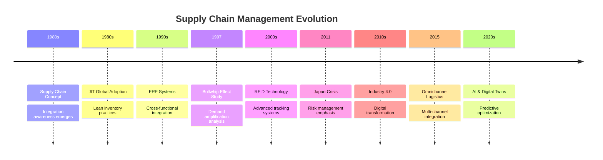

```mermaid
timeline
    title Supply Chain Management Evolution
    1980s : Supply Chain Concept
          : Integration awareness emerges
    1980s : JIT Global Adoption
          : Lean inventory practices
    1990s : ERP Systems
          : Cross-functional integration
    1997 : Bullwhip Effect Study
         : Demand amplification analysis
    2000s : RFID Technology
          : Advanced tracking systems
    2011 : Japan Crisis
         : Risk management emphasis
    2010s : Industry 4.0
          : Digital transformation
    2015 : Omnichannel Logistics
         : Multi-channel integration
    2020s : AI & Digital Twins
          : Predictive optimization
```
