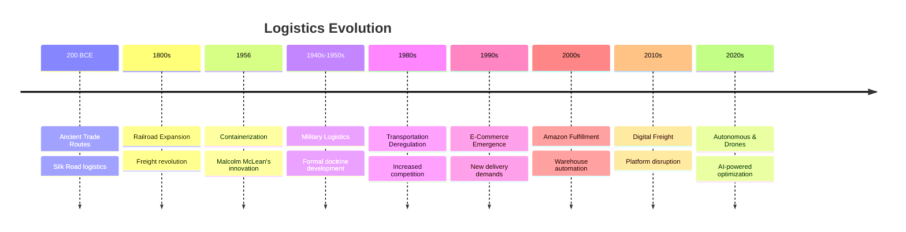

```mermaid
timeline
    title Logistics Evolution
    200 BCE : Ancient Trade Routes
            : Silk Road logistics
    1800s : Railroad Expansion
          : Freight revolution
    1956 : Containerization
         : Malcolm McLean's innovation
    1940s-1950s : Military Logistics
                : Formal doctrine development
    1980s : Transportation Deregulation
          : Increased competition
    1990s : E-Commerce Emergence
          : New delivery demands
    2000s : Amazon Fulfillment
          : Warehouse automation
    2010s : Digital Freight
          : Platform disruption
    2020s : Autonomous & Drones
          : AI-powered optimization
```
