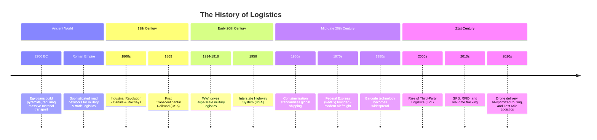

```mermaid
timeline
    title The History of Logistics
    section Ancient World
        2700 BC : Egyptians build pyramids, requiring massive material transport
        Roman Empire : Sophisticated road networks for military & trade logistics
    section 19th Century
        1800s : Industrial Revolution - Canals & Railways
        1869 : First Transcontinental Railroad (USA)
    section Early 20th Century
        1914-1918 : WWI drives large-scale military logistics
        1956 : Interstate Highway System (USA)
    section Mid-Late 20th Century
        1960s : Containerization standardizes global shipping
        1970s : Federal Express (FedEx) founded - modern air freight
        1980s : Barcode technology becomes widespread
    section 21st Century
        2000s : Rise of Third-Party Logistics (3PL)
        2010s : GPS, RFID, and real-time tracking
        2020s : Drone delivery, AI-optimized routing, and Last-Mile Logistics
```
