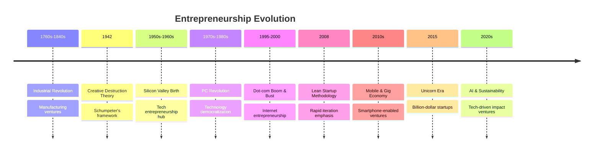

```mermaid
timeline
    title Entrepreneurship Evolution
    1760s-1840s : Industrial Revolution
                : Manufacturing ventures
    1942 : Creative Destruction Theory
         : Schumpeter's framework
    1950s-1960s : Silicon Valley Birth
                : Tech entrepreneurship hub
    1970s-1980s : PC Revolution
                : Technology democratization
    1995-2000 : Dot-com Boom & Bust
              : Internet entrepreneurship
    2008 : Lean Startup Methodology
         : Rapid iteration emphasis
    2010s : Mobile & Gig Economy
          : Smartphone-enabled ventures
    2015 : Unicorn Era
         : Billion-dollar startups
    2020s : AI & Sustainability
          : Tech-driven impact ventures
```
