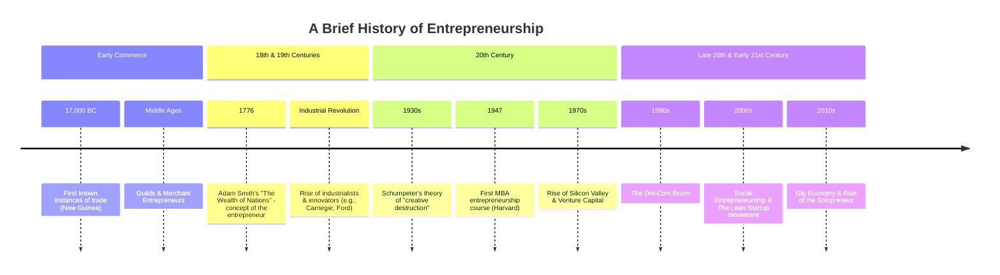

```mermaid
timeline
    title A Brief History of Entrepreneurship
    section Early Commerce
        17,000 BC : First known instances of trade (New Guinea)
        Middle Ages : Guilds & Merchant Entrepreneurs
    section 18th & 19th Centuries
        1776 : Adam Smith's "The Wealth of Nations" - concept of the entrepreneur
        Industrial Revolution : Rise of industrialists & innovators (e.g., Carnegie, Ford)
    section 20th Century
        1930s : Schumpeter's theory of "creative destruction"
        1947 : First MBA entrepreneurship course (Harvard)
        1970s : Rise of Silicon Valley & Venture Capital
    section Late 20th & Early 21st Century
        1990s : The Dot-Com Boom
        2000s : Social Entrepreneurship & The Lean Startup movement
        2010s : Gig Economy & Rise of the Solopreneur
```
