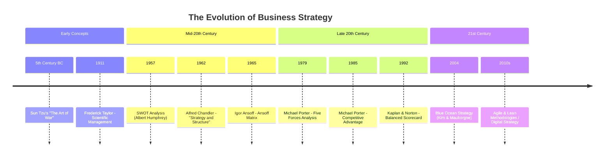

```mermaid
timeline
    title The Evolution of Business Strategy
    section Early Concepts
        5th Century BC : Sun Tzu's "The Art of War"
        1911 : Frederick Taylor - Scientific Management
    section Mid-20th Century
        1957 : SWOT Analysis (Albert Humphrey)
        1962 : Alfred Chandler - "Strategy and Structure"
        1965 : Igor Ansoff - Ansoff Matrix
    section Late 20th Century
        1979 : Michael Porter - Five Forces Analysis
        1985 : Michael Porter - Competitive Advantage
        1992 : Kaplan & Norton - Balanced Scorecard
    section 21st Century
        2004 : Blue Ocean Strategy (Kim & Mauborgne)
        2010s : Agile & Lean Methodologies / Digital Strategy
```
