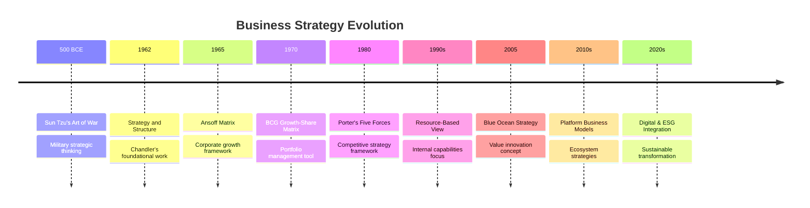

```mermaid
timeline
    title Business Strategy Evolution
    500 BCE : Sun Tzu's Art of War
            : Military strategic thinking
    1962 : Strategy and Structure
         : Chandler's foundational work
    1965 : Ansoff Matrix
         : Corporate growth framework
    1970 : BCG Growth-Share Matrix
         : Portfolio management tool
    1980 : Porter's Five Forces
         : Competitive strategy framework
    1990s : Resource-Based View
          : Internal capabilities focus
    2005 : Blue Ocean Strategy
         : Value innovation concept
    2010s : Platform Business Models
          : Ecosystem strategies
    2020s : Digital & ESG Integration
          : Sustainable transformation
```
