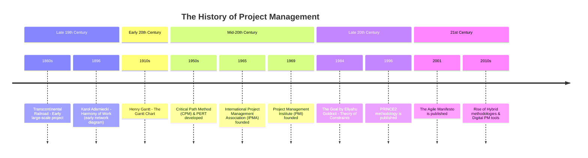

```mermaid
timeline
    title The History of Project Management
    section Late 19th Century
        1860s : Transcontinental Railroad - Early large-scale project
        1896 : Karol Adamiecki - Harmony of Work (early network diagram)
    section Early 20th Century
        1910s : Henry Gantt - The Gantt Chart
    section Mid-20th Century
        1950s : Critical Path Method (CPM) & PERT developed
        1965 : International Project Management Association (IPMA) founded
        1969 : Project Management Institute (PMI) founded
    section Late 20th Century
        1984 : The Goal by Eliyahu Goldratt - Theory of Constraints
        1996 : PRINCE2 methodology is published
    section 21st Century
        2001 : The Agile Manifesto is published
        2010s : Rise of Hybrid methodologies & Digital PM tools
```
