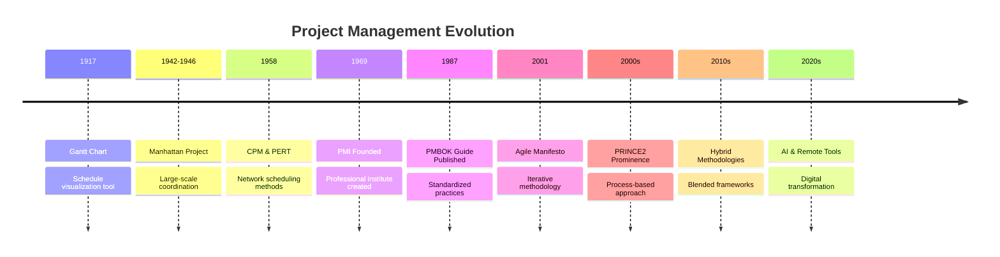

```mermaid
timeline
    title Project Management Evolution
    1917 : Gantt Chart
         : Schedule visualization tool
    1942-1946 : Manhattan Project
              : Large-scale coordination
    1958 : CPM & PERT
         : Network scheduling methods
    1969 : PMI Founded
         : Professional institute created
    1987 : PMBOK Guide Published
         : Standardized practices
    2001 : Agile Manifesto
         : Iterative methodology
    2000s : PRINCE2 Prominence
          : Process-based approach
    2010s : Hybrid Methodologies
          : Blended frameworks
    2020s : AI & Remote Tools
          : Digital transformation
```
