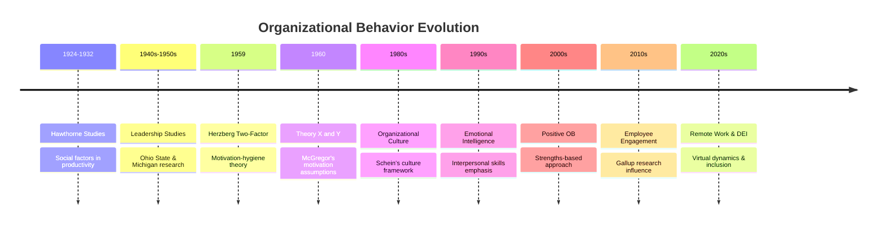

```mermaid
timeline
    title Organizational Behavior Evolution
    1924-1932 : Hawthorne Studies
              : Social factors in productivity
    1940s-1950s : Leadership Studies
                : Ohio State & Michigan research
    1959 : Herzberg Two-Factor
         : Motivation-hygiene theory
    1960 : Theory X and Y
         : McGregor's motivation assumptions
    1980s : Organizational Culture
          : Schein's culture framework
    1990s : Emotional Intelligence
          : Interpersonal skills emphasis
    2000s : Positive OB
          : Strengths-based approach
    2010s : Employee Engagement
          : Gallup research influence
    2020s : Remote Work & DEI
          : Virtual dynamics & inclusion
```
