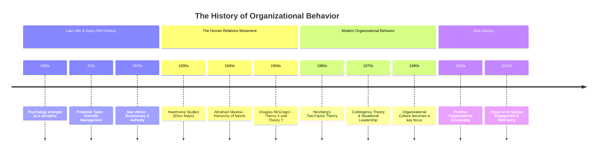

```mermaid
timeline
    title The History of Organizational Behavior
    section Late 19th & Early 20th Century
        1890s : Psychology emerges as a discipline
        1911 : Frederick Taylor - Scientific Management
        1920s : Max Weber - Bureaucracy & Authority
    section The Human Relations Movement
        1930s : Hawthorne Studies (Elton Mayo)
        1940s : Abraham Maslow - Hierarchy of Needs
        1950s : Douglas McGregor - Theory X and Theory Y
    section Modern Organizational Behavior
        1960s : Herzberg's Two-Factor Theory
        1970s : Contingency Theory & Situational Leadership
        1980s : Organizational Culture becomes a key focus
    section 21st Century
        2000s : Positive Organizational Scholarship
        2010s : Focus on Employee Engagement & Well-being
```
