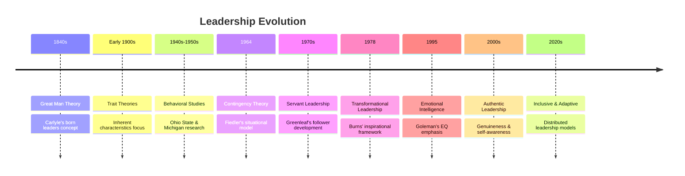

```mermaid
timeline
    title Leadership Evolution
    1840s : Great Man Theory
          : Carlyle's born leaders concept
    Early 1900s : Trait Theories
                : Inherent characteristics focus
    1940s-1950s : Behavioral Studies
                : Ohio State & Michigan research
    1964 : Contingency Theory
         : Fiedler's situational model
    1970s : Servant Leadership
          : Greenleaf's follower development
    1978 : Transformational Leadership
         : Burns' inspirational framework
    1995 : Emotional Intelligence
         : Goleman's EQ emphasis
    2000s : Authentic Leadership
          : Genuineness & self-awareness
    2020s : Inclusive & Adaptive
          : Distributed leadership models
```
