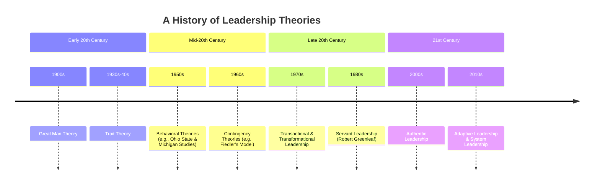

```mermaid
timeline
    title A History of Leadership Theories
    section Early 20th Century
        1900s : Great Man Theory
        1930s-40s : Trait Theory
    section Mid-20th Century
        1950s : Behavioral Theories (e.g., Ohio State & Michigan Studies)
        1960s : Contingency Theories (e.g., Fiedler's Model)
    section Late 20th Century
        1970s : Transactional & Transformational Leadership
        1980s : Servant Leadership (Robert Greenleaf)
    section 21st Century
        2000s : Authentic Leadership
        2010s : Adaptive Leadership & System Leadership
```
