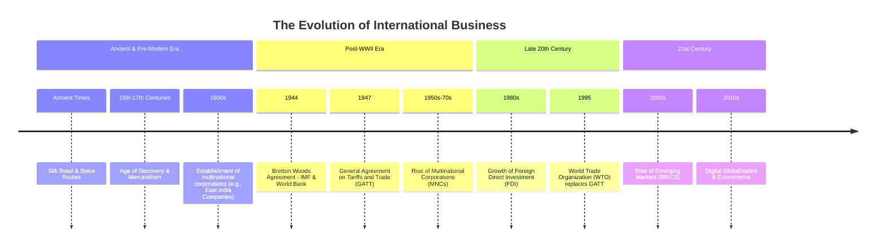

```mermaid
timeline
    title The Evolution of International Business
    section Ancient & Pre-Modern Era
        Ancient Times : Silk Road & Spice Routes
        15th-17th Centuries : Age of Discovery & Mercantilism
        1600s : Establishment of multinational corporations (e.g., East India Companies)
    section Post-WWII Era
        1944 : Bretton Woods Agreement - IMF & World Bank
        1947 : General Agreement on Tariffs and Trade (GATT)
        1950s-70s : Rise of Multinational Corporations (MNCs)
    section Late 20th Century
        1980s : Growth of Foreign Direct Investment (FDI)
        1995 : World Trade Organization (WTO) replaces GATT
    section 21st Century
        2000s : Rise of Emerging Markets (BRICS)
        2010s : Digital Globalization & E-commerce
```
