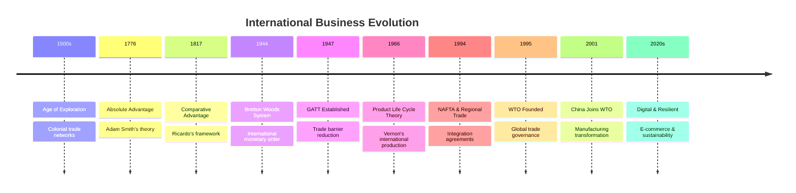

```mermaid
timeline
    title International Business Evolution
    1500s : Age of Exploration
          : Colonial trade networks
    1776 : Absolute Advantage
         : Adam Smith's theory
    1817 : Comparative Advantage
         : Ricardo's framework
    1944 : Bretton Woods System
         : International monetary order
    1947 : GATT Established
         : Trade barrier reduction
    1966 : Product Life Cycle Theory
         : Vernon's international production
    1994 : NAFTA & Regional Trade
         : Integration agreements
    1995 : WTO Founded
         : Global trade governance
    2001 : China Joins WTO
         : Manufacturing transformation
    2020s : Digital & Resilient
          : E-commerce & sustainability
```
