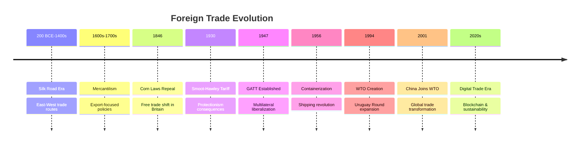

```mermaid
timeline
    title Foreign Trade Evolution
    200 BCE-1400s : Silk Road Era
                  : East-West trade routes
    1600s-1700s : Mercantilism
                : Export-focused policies
    1846 : Corn Laws Repeal
         : Free trade shift in Britain
    1930 : Smoot-Hawley Tariff
         : Protectionism consequences
    1947 : GATT Established
         : Multilateral liberalization
    1956 : Containerization
         : Shipping revolution
    1994 : WTO Creation
         : Uruguay Round expansion
    2001 : China Joins WTO
         : Global trade transformation
    2020s : Digital Trade Era
          : Blockchain & sustainability
```
