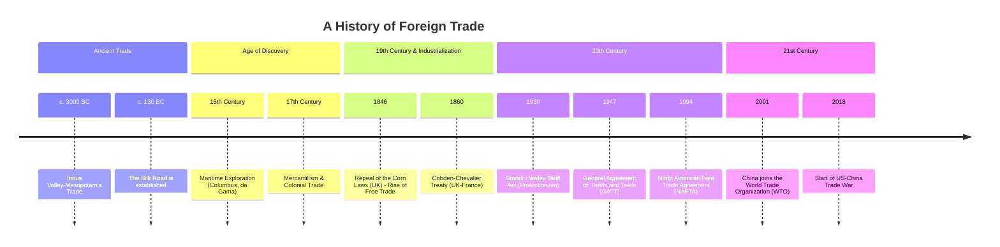

```mermaid
timeline
    title A History of Foreign Trade
    section Ancient Trade
        c. 3000 BC : Indus Valley-Mesopotamia Trade
        c. 130 BC : The Silk Road is established
    section Age of Discovery
        15th Century : Maritime Exploration (Columbus, da Gama)
        17th Century : Mercantilism & Colonial Trade
    section 19th Century & Industrialization
        1846 : Repeal of the Corn Laws (UK) - Rise of Free Trade
        1860 : Cobden-Chevalier Treaty (UK-France)
    section 20th Century
        1930 : Smoot-Hawley Tariff Act (Protectionism)
        1947 : General Agreement on Tariffs and Trade (GATT)
        1994 : North American Free Trade Agreement (NAFTA)
    section 21st Century
        2001 : China joins the World Trade Organization (WTO)
        2018 : Start of US-China Trade War
```
