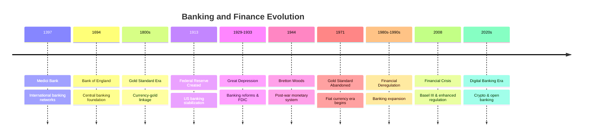

```mermaid
timeline
    title Banking and Finance Evolution
    1397 : Medici Bank
         : International banking networks
    1694 : Bank of England
         : Central banking foundation
    1800s : Gold Standard Era
          : Currency-gold linkage
    1913 : Federal Reserve Created
         : US banking stabilization
    1929-1933 : Great Depression
              : Banking reforms & FDIC
    1944 : Bretton Woods
         : Post-war monetary system
    1971 : Gold Standard Abandoned
         : Fiat currency era begins
    1980s-1990s : Financial Deregulation
                : Banking expansion
    2008 : Financial Crisis
         : Basel III & enhanced regulation
    2020s : Digital Banking Era
          : Crypto & open banking
```
