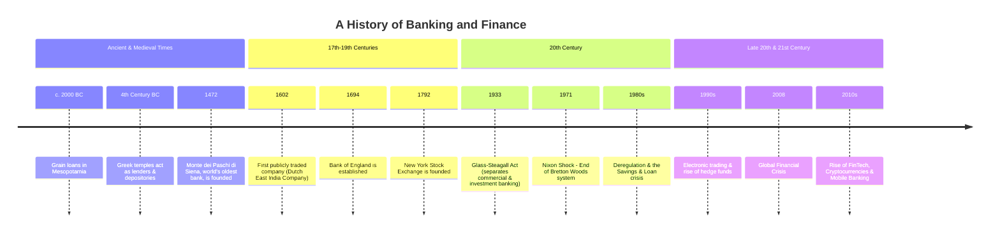

```mermaid
timeline
    title A History of Banking and Finance
    section Ancient & Medieval Times
        c. 2000 BC : Grain loans in Mesopotamia
        4th Century BC : Greek temples act as lenders & depositories
        1472 : Monte dei Paschi di Siena, world's oldest bank, is founded
    section 17th-19th Centuries
        1602 : First publicly traded company (Dutch East India Company)
        1694 : Bank of England is established
        1792 : New York Stock Exchange is founded
    section 20th Century
        1933 : Glass-Steagall Act (separates commercial & investment banking)
        1971 : Nixon Shock - End of Bretton Woods system
        1980s : Deregulation & the Savings & Loan crisis
    section Late 20th & 21st Century
        1990s : Electronic trading & rise of hedge funds
        2008 : Global Financial Crisis
        2010s : Rise of FinTech, Cryptocurrencies & Mobile Banking
```
