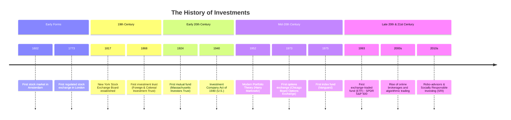

```mermaid
timeline
    title The History of Investments
    section Early Forms
        1602 : First stock market in Amsterdam
        1773 : First regulated stock exchange in London
    section 19th Century
        1817 : New York Stock Exchange Board established
        1868 : First investment trust (Foreign & Colonial Investment Trust)
    section Early 20th Century
        1924 : First mutual fund (Massachusetts Investors Trust)
        1940 : Investment Company Act of 1940 (U.S.)
    section Mid-20th Century
        1952 : Modern Portfolio Theory (Harry Markowitz)
        1973 : First options exchange (Chicago Board Options Exchange)
        1975 : First index fund (Vanguard)
    section Late 20th & 21st Century
        1993 : First exchange-traded fund (ETF) - SPDR S&P 500
        2000s : Rise of online brokerages and algorithmic trading
        2010s : Robo-advisors & Socially Responsible Investing (SRI)
```
