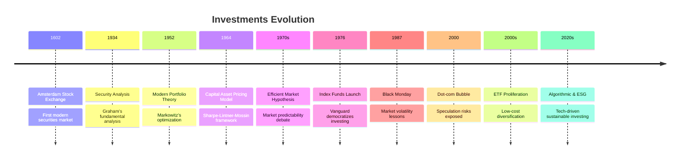

```mermaid
timeline
    title Investments Evolution
    1602 : Amsterdam Stock Exchange
         : First modern securities market
    1934 : Security Analysis
         : Graham's fundamental analysis
    1952 : Modern Portfolio Theory
         : Markowitz's optimization
    1964 : Capital Asset Pricing Model
         : Sharpe-Lintner-Mossin framework
    1970s : Efficient Market Hypothesis
          : Market predictability debate
    1976 : Index Funds Launch
         : Vanguard democratizes investing
    1987 : Black Monday
         : Market volatility lessons
    2000 : Dot-com Bubble
         : Speculation risks exposed
    2000s : ETF Proliferation
          : Low-cost diversification
    2020s : Algorithmic & ESG
          : Tech-driven sustainable investing
```
