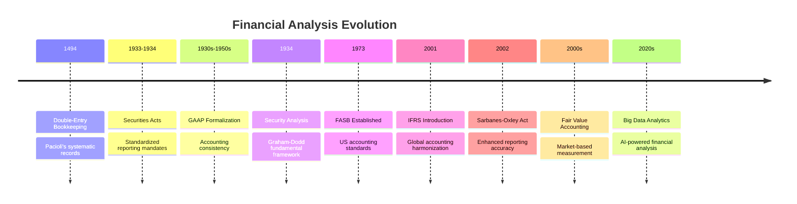

```mermaid
timeline
    title Financial Analysis Evolution
    1494 : Double-Entry Bookkeeping
         : Pacioli's systematic records
    1933-1934 : Securities Acts
              : Standardized reporting mandates
    1930s-1950s : GAAP Formalization
                : Accounting consistency
    1934 : Security Analysis
         : Graham-Dodd fundamental framework
    1973 : FASB Established
         : US accounting standards
    2001 : IFRS Introduction
         : Global accounting harmonization
    2002 : Sarbanes-Oxley Act
         : Enhanced reporting accuracy
    2000s : Fair Value Accounting
          : Market-based measurement
    2020s : Big Data Analytics
          : AI-powered financial analysis
```
