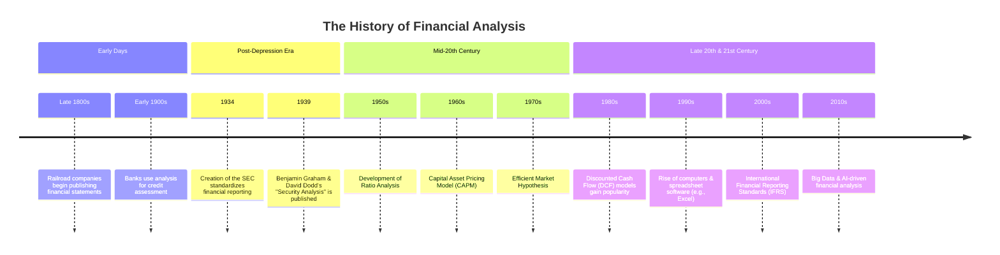

```mermaid
timeline
    title The History of Financial Analysis
    section Early Days
        Late 1800s : Railroad companies begin publishing financial statements
        Early 1900s : Banks use analysis for credit assessment
    section Post-Depression Era
        1934 : Creation of the SEC standardizes financial reporting
        1939 : Benjamin Graham & David Dodd's "Security Analysis" is published
    section Mid-20th Century
        1950s : Development of Ratio Analysis
        1960s : Capital Asset Pricing Model (CAPM)
        1970s : Efficient Market Hypothesis
    section Late 20th & 21st Century
        1980s : Discounted Cash Flow (DCF) models gain popularity
        1990s : Rise of computers & spreadsheet software (e.g., Excel)
        2000s : International Financial Reporting Standards (IFRS)
        2010s : Big Data & AI-driven financial analysis
```
