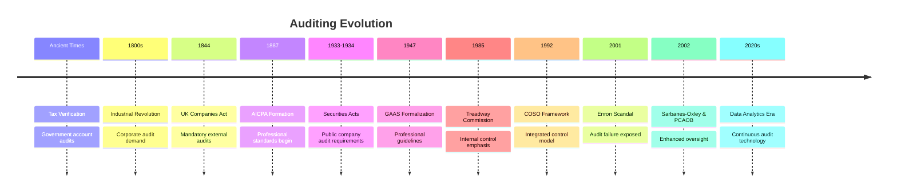

```mermaid
timeline
    title Auditing Evolution
    Ancient Times : Tax Verification
                  : Government account audits
    1800s : Industrial Revolution
          : Corporate audit demand
    1844 : UK Companies Act
         : Mandatory external audits
    1887 : AICPA Formation
         : Professional standards begin
    1933-1934 : Securities Acts
              : Public company audit requirements
    1947 : GAAS Formalization
         : Professional guidelines
    1985 : Treadway Commission
         : Internal control emphasis
    1992 : COSO Framework
         : Integrated control model
    2001 : Enron Scandal
         : Audit failure exposed
    2002 : Sarbanes-Oxley & PCAOB
         : Enhanced oversight
    2020s : Data Analytics Era
          : Continuous audit technology
```
