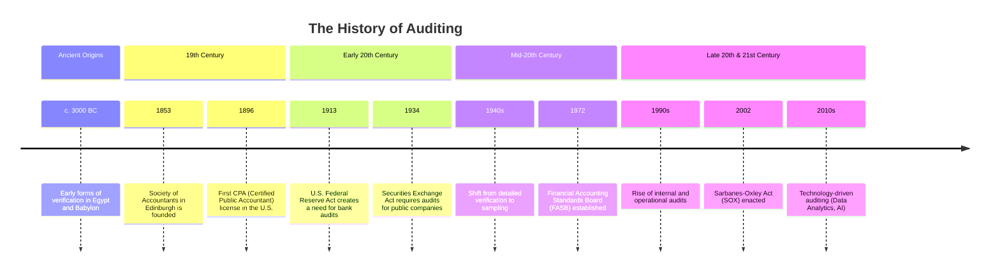

```mermaid
timeline
    title The History of Auditing
    section Ancient Origins
        c. 3000 BC : Early forms of verification in Egypt and Babylon
    section 19th Century
        1853 : Society of Accountants in Edinburgh is founded
        1896 : First CPA (Certified Public Accountant) license in the U.S.
    section Early 20th Century
        1913 : U.S. Federal Reserve Act creates a need for bank audits
        1934 : Securities Exchange Act requires audits for public companies
    section Mid-20th Century
        1940s : Shift from detailed verification to sampling
        1972 : Financial Accounting Standards Board (FASB) established
    section Late 20th & 21st Century
        1990s : Rise of internal and operational audits
        2002 : Sarbanes-Oxley Act (SOX) enacted
        2010s : Technology-driven auditing (Data Analytics, AI)
```
