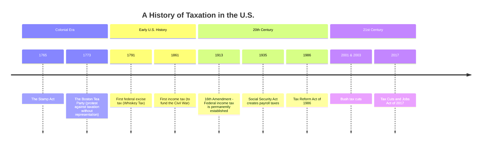

```mermaid
timeline
    title A History of Taxation in the U.S.
    section Colonial Era
        1765 : The Stamp Act
        1773 : The Boston Tea Party (protest against taxation without representation)
    section Early U.S. History
        1791 : First federal excise tax (Whiskey Tax)
        1861 : First income tax (to fund the Civil War)
    section 20th Century
        1913 : 16th Amendment - Federal income tax is permanently established
        1935 : Social Security Act creates payroll taxes
        1986 : Tax Reform Act of 1986
    section 21st Century
        2001 & 2003 : Bush tax cuts
        2017 : Tax Cuts and Jobs Act of 2017
```
