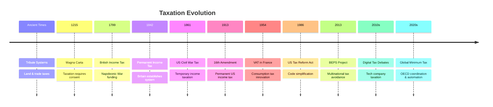

```mermaid
timeline
    title Taxation Evolution
    Ancient Times : Tribute Systems
                  : Land & trade taxes
    1215 : Magna Carta
         : Taxation requires consent
    1799 : British Income Tax
         : Napoleonic War funding
    1842 : Permanent Income Tax
         : Britain establishes system
    1861 : US Civil War Tax
         : Temporary income taxation
    1913 : 16th Amendment
         : Permanent US income tax
    1954 : VAT in France
         : Consumption tax innovation
    1986 : US Tax Reform Act
         : Code simplification
    2013 : BEPS Project
         : Multinational tax avoidance
    2010s : Digital Tax Debates
          : Tech company taxation
    2020s : Global Minimum Tax
          : OECD coordination & automation
```
