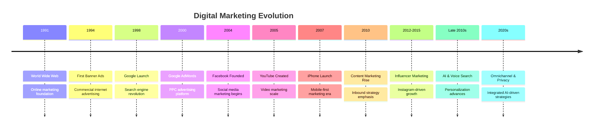

```mermaid
timeline
    title Digital Marketing Evolution
    1991 : World Wide Web
         : Online marketing foundation
    1994 : First Banner Ads
         : Commercial internet advertising
    1998 : Google Launch
         : Search engine revolution
    2000 : Google AdWords
         : PPC advertising platform
    2004 : Facebook Founded
         : Social media marketing begins
    2005 : YouTube Created
         : Video marketing scale
    2007 : iPhone Launch
         : Mobile-first marketing era
    2010 : Content Marketing Rise
         : Inbound strategy emphasis
    2012-2015 : Influencer Marketing
              : Instagram-driven growth
    Late 2010s : AI & Voice Search
               : Personalization advances
    2020s : Omnichannel & Privacy
          : Integrated AI-driven strategies
```
