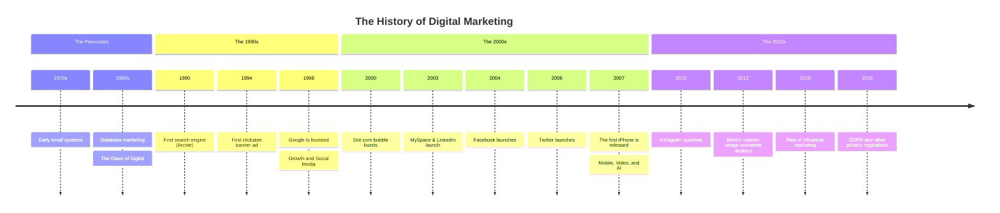

```mermaid
timeline
    title The History of Digital Marketing
    section The Precursors
        1970s : Early email systems
        1980s : Database marketing
    section The 1990s: The Dawn of Digital
        1990 : First search engine (Archie)
        1994 : First clickable banner ad
        1998 : Google is founded
    section The 2000s: Growth and Social Media
        2000 : Dot-com bubble bursts
        2003 : MySpace & LinkedIn launch
        2004 : Facebook launches
        2006 : Twitter launches
        2007 : The first iPhone is released
    section The 2010s: Mobile, Video, and AI
        2010 : Instagram launches
        2012 : Mobile internet usage overtakes desktop
        2016 : Rise of influencer marketing
        2018 : GDPR and other privacy regulations
```
