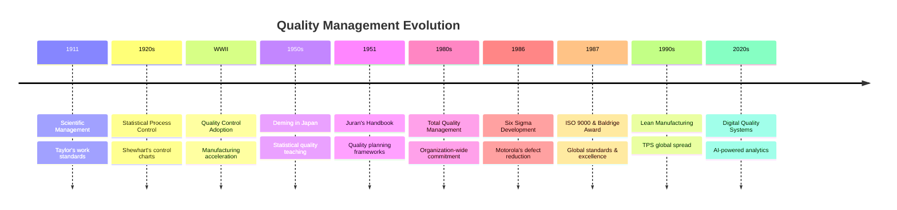

```mermaid
timeline
    title Quality Management Evolution
    1911 : Scientific Management
         : Taylor's work standards
    1920s : Statistical Process Control
          : Shewhart's control charts
    WWII : Quality Control Adoption
         : Manufacturing acceleration
    1950s : Deming in Japan
          : Statistical quality teaching
    1951 : Juran's Handbook
         : Quality planning frameworks
    1980s : Total Quality Management
          : Organization-wide commitment
    1986 : Six Sigma Development
         : Motorola's defect reduction
    1987 : ISO 9000 & Baldrige Award
         : Global standards & excellence
    1990s : Lean Manufacturing
          : TPS global spread
    2020s : Digital Quality Systems
          : AI-powered analytics
```
