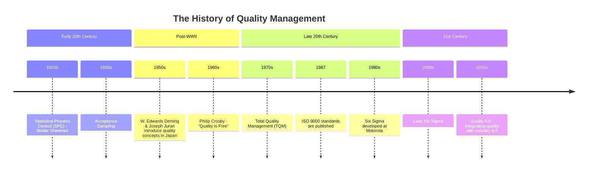

```mermaid
timeline
    title The History of Quality Management
    section Early 20th Century
        1920s : Statistical Process Control (SPC) - Walter Shewhart
        1930s : Acceptance Sampling
    section Post-WWII
        1950s : W. Edwards Deming & Joseph Juran introduce quality concepts in Japan
        1960s : Philip Crosby - "Quality is Free"
    section Late 20th Century
        1970s : Total Quality Management (TQM)
        1987 : ISO 9000 standards are published
        1980s : Six Sigma developed at Motorola
    section 21st Century
        2000s : Lean Six Sigma
        2010s : Quality 4.0 - Integrating quality with Industry 4.0
```
